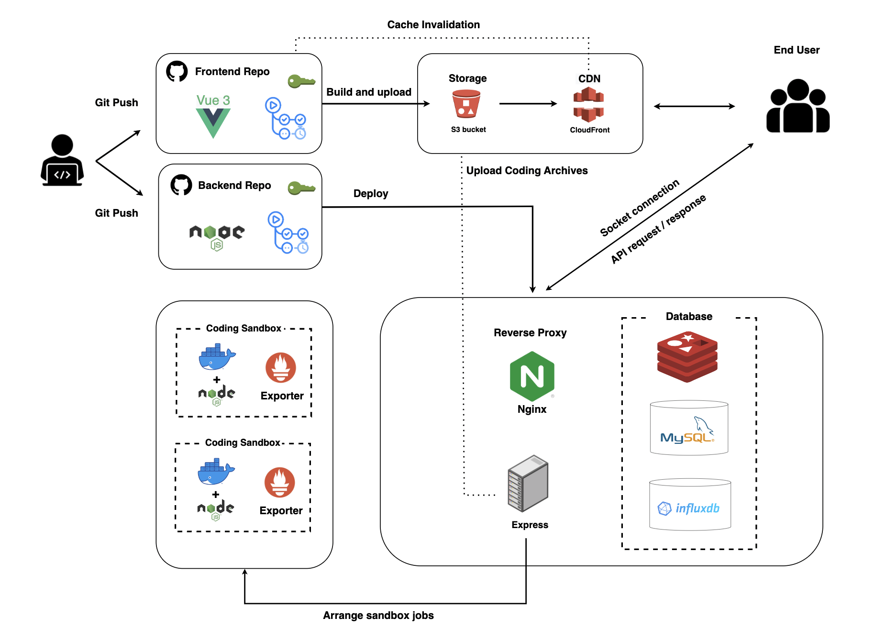

# Bunny Code

> A brand new coding website. Supports replaying coding process and launching a coding battle. For more information, please check out [Bunny Code](https://www.domingoos.store).

## Table of content

- [Background and Why Bunny Code](#background-and-why-bunny-code)
- [Links](#links)
- [Demo](#demo)
- [Features - Workspace](#features---workspace)
- [Features - Battle Valley](#features---battle-valley)
- [Tech Stack](#tech-stack)
- [System architechture](#system-architechture)
- [Future Features](#future-features)

## Background and Why Bunny Code

Being a software engineer, we learn continuously to enrich ourselves. However, there are no integrated resources where we could learn from other people's `coding processes` and edit our own project at the same time. Not to mention `battle with each other`.

Bunny Code was borned to cope with the problem. Bunny Code is dedicated to help users learn by replaying coding processes as if video clips and practice by launching live battles. With Bunny Code, users can `edit codes`, `run codes`, `control versions`, `replay codes`, `launch battles` whenever they want !

## Links

**Bunny Code Homepage**: [Bunny Code](https://domingoos.store)

```
// first user
Account: domingoos@gmail.com
Password: test1234

// second user (for battle)
Account: guest@gmail.com
Password: test1234
```

**Frontend Github repo**: [Bunny-code-vue](https://github.com/domingo1021/Bunny-code-vue)

**Backend repo**: [Bunny-code](https://github.com/domingo1021/Bunny-code)

## Features - Workspace

- **Record** and **replay** users' projects in workspace
- Provide **play**, **pause**, **speed up** and **slow down** to help user to replay coding processes as if watching video clips.
- **Preview coding archives** of projects at the first time users go into the workspace.
- Provide various **shortcuts** to help developers edit project much faster.
- Allow user **run codes** immediately after they edit codes or watch codes.
- **Create version** from latest coding process and provide **version control**. Help users compare differences between version by replaying projects' coding processes.

## Features - Battle Valley

- **Choose a question level**, **launch a battle**, then user can compete with others in battle valley.
- **Watch a live battle** in battle valley as long as user want.
- **Run codes** to check the answer of the appointed question.
- Compare **expected outputs** and **battler coding outputs** for test cases, help battlers to improve their codes.
- **Share winner coding archives** of battles to help users learn from each other.

## Demo

- Replay coding process ( x1 )

  

- Replay coding process ( x2 )

  

- Run code (Normal situation)

  

- Run code (Out of memory)

  

- Battle valley

  

## Tech stack

- Frontend: `HTML` `CSS` `Vue.js` `Bootstrap`
- Backend: `Node.js` `Express` `Socket.IO`
- Database: `MySQL` `InfluxDB` `Redis`
- Sandbox: `Shell` `Docker` `Prometheus exporter`
- Cloud services: `S3` `CloudFront` `CloudWatch`
- Continuous development: `GitHub Actions`

## System architechture



## Future Features

- More `shortcuts` in workspace. For example: `redo`, `undo`, and etc.
- `Friend` and `follower` mechanism. Help users invite battles to a target person.
